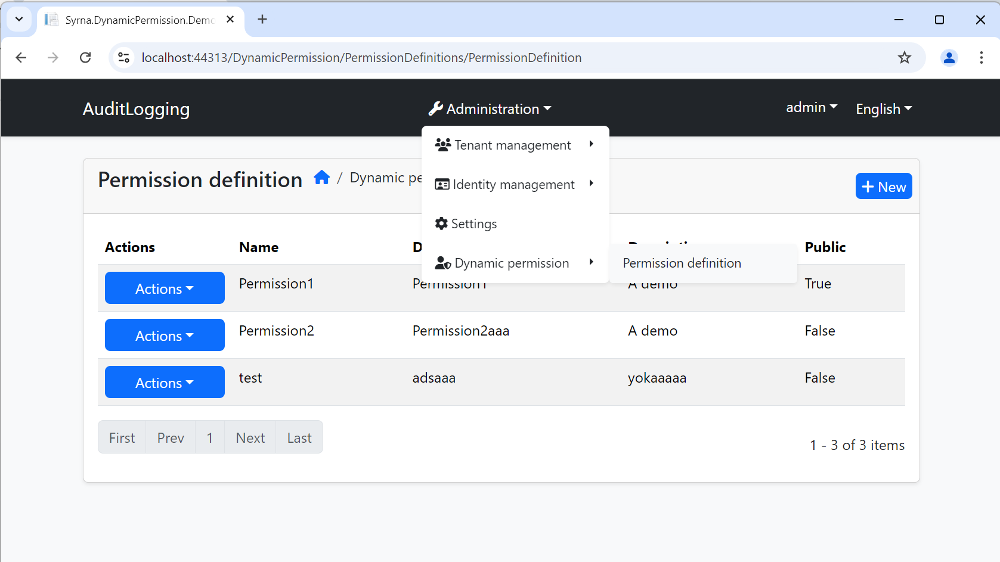
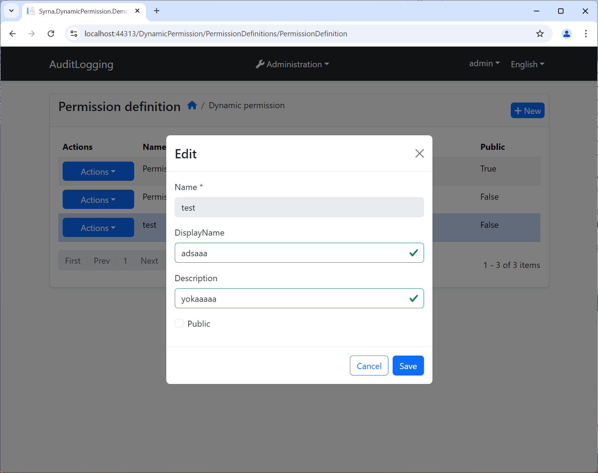
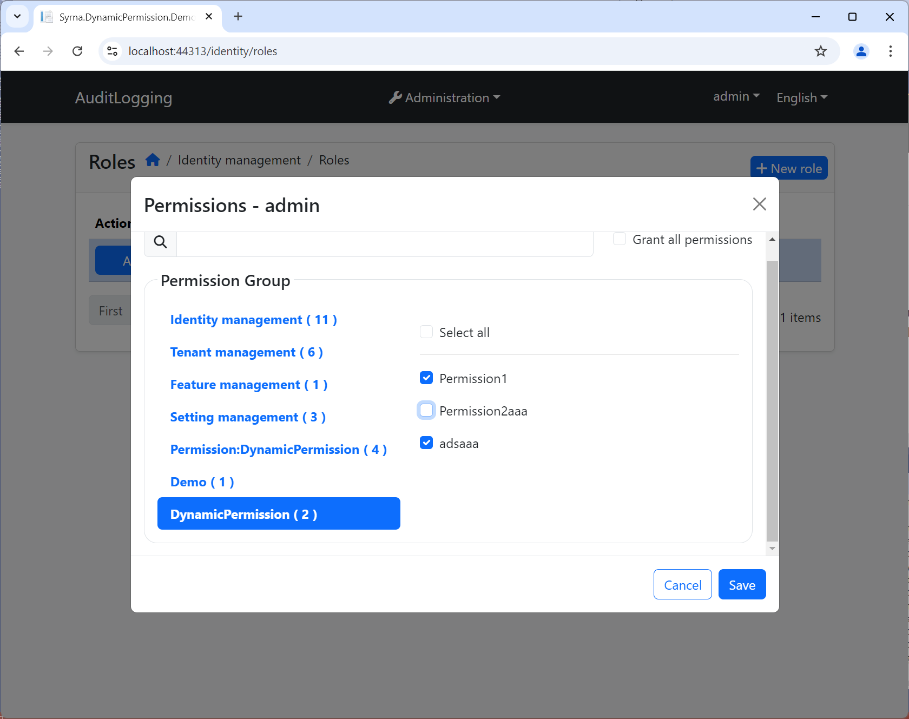

# Syrna.DynamicPermission
Dynamic permission module for ABP framework.

 

An ABP module that allows you to define and grant dynamic permissions in runtime.

## Installation

1. Install the following NuGet packages. ([see how](https://github.com/SyrnaAbp/SyrnaAbpGuide/blob/master/docs/How-To.md#add-nuget-packages))

    * Syrna.DynamicPermission.Application
    * Syrna.DynamicPermission.Application.Contracts
    * Syrna.DynamicPermission.Domain
    * Syrna.DynamicPermission.Domain.Shared
    * Syrna.DynamicPermission.EntityFrameworkCore
    * Syrna.DynamicPermission.HttpApi
    * Syrna.DynamicPermission.HttpApi.Client
    * Syrna.DynamicPermission.Web
    * Syrna.DynamicPermission.Blazor
    * Syrna.DynamicPermission.Blazor.Server
    * Syrna.DynamicPermission.Blazor.WebAssembly

1. Add `DependsOn(typeof(SyrnaDynamicPermissionXxxModule))` attribute to configure the module dependencies. ([see how](https://github.com/SyrnaAbp/SyrnaAbpGuide/blob/master/docs/How-To.md#add-module-dependencies))

1. Add `builder.ConfigureDynamicPermission();` to the `OnModelCreating()` method in **MyProjectMigrationsDbContext.cs**.

1. Add EF Core migrations and update your database. See: [ABP document](https://docs.abp.io/en/abp/latest/Tutorials/Part-1?UI=MVC&DB=EF#add-database-migration).

## Usage

## Reference

### This project based on [EasyAbp DynamicPermission](https://github.com/EasyAbp/Abp.DynamicPermission)

### Differences

1. Demo project created for OpenIddict
2. Demo project extended modules added
3. Blazor modules added
4. Db schema refatored
5. Blazor modules implemented
6. AspNetCore Web refactored

